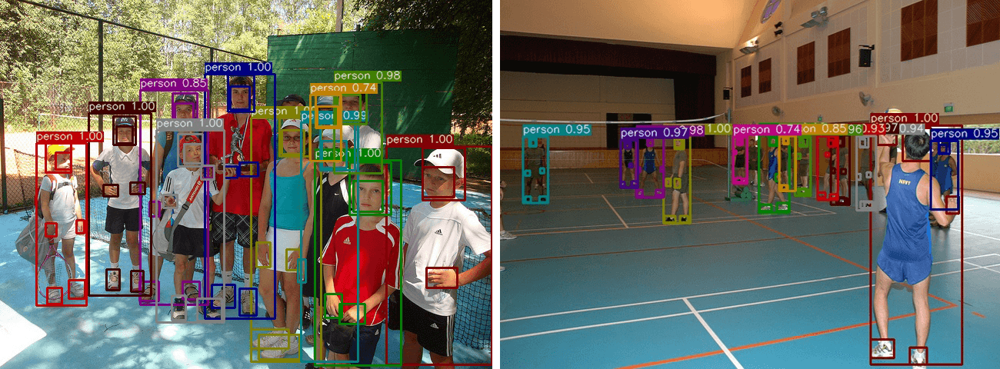
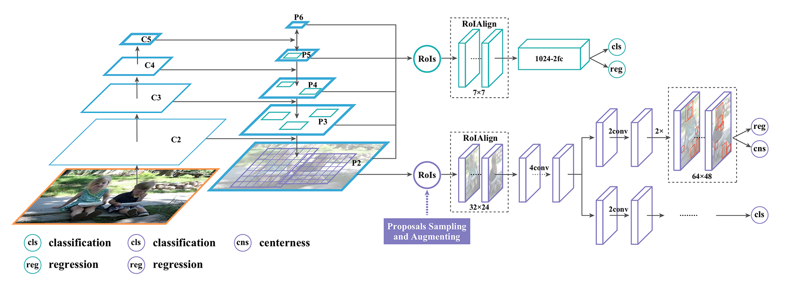

# Hier-R-CNN
Hier R-CNN: Instance-level Human Parts Detection and A New Benchmark (under review)

In this repository, we release the COCO Human Parts dataset and Hier R-CNN code in Pytorch.

- Hier R-CNN output
<p align="center"></p>

- Hier R-CNN architecture
<p align="center"></p>


## Installation
- 8 x TITAN Xp GPU
- pytorch1.1
- python3.6.8

Install Hier R-CNN following [INSTALL.md](https://github.com/soeaver/Hier-R-CNN/blob/master/INSTALL.md).


## ImageNet pretrained weight

- [R50](https://dl.dropbox.com/s/s7f4vyfybyc9qpr/vovnet39_statedict_norm.pth?dl=1)
- [R101](https://dl.dropbox.com/s/b826phjle6kbamu/vovnet57_statedict_norm.pth?dl=1)
- [X101-32x8d](https://dl.dropbox.com/s/ve1h1ol2ge7yfta/vovnet75_statedict_norm.pth.tar?dl=1)


## Results and Models
|  Backbone  |  LR  | MS training | DCN | Det AP (AP/APt/APs/APm/APl)  | Sub AP (AP/APs/APm/APl)  | DOWNLOAD |
|------------|:----:|:-----------:|:---:|:----------------------------:|:------------------------:| :-------:|
|  R-50-FPN  |  1x  | No          | No  | 36.8/19.9/41.9/53.9/47.5     | 33.5/14.4/29.9/47.1      | [GoogleDrive](https://dl.dropbox.com/s/8n0wyypfggliplw/FCOS-V-39-FPN-1x.pth?dl=1)|
|  R-50-FPN  |  2x  | Yes         | No  | 39.3/22.0/45.0/56.5/49.4     | 37.3/16.8/33.1/52.0      |          |

## Training

To train a model with 8 GPUs run:
```
python -m torch.distributed.launch --nproc_per_node=8 tools/train_net.py --cfg cfgs/mscoco_humanparts/e2e_hier_rcnn_R-50-FPN_1x.yaml
```


## Evaluation

### multi-gpu evaluation,
```
python tools/test_net.py --cfg ckpts/mscoco_humanparts/e2e_hier_rcnn_R-50-FPN_1x/e2e_hier_rcnn_R-50-FPN_1x.yaml --gpu_id 0,1,2,3,4,5,6,7
```

### single-gpu evaluation,
```
python tools/test_net.py --cfg ckpts/mscoco_humanparts/e2e_hier_rcnn_R-50-FPN_1x/e2e_hier_rcnn_R-50-FPN_1x.yaml --gpu_id 0
```

